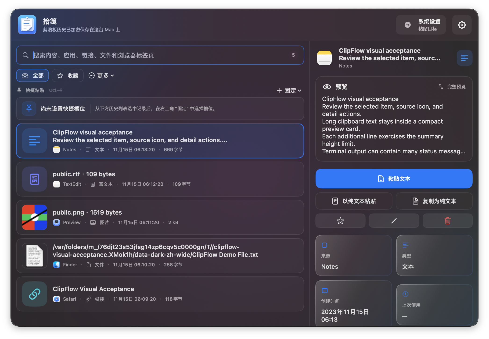
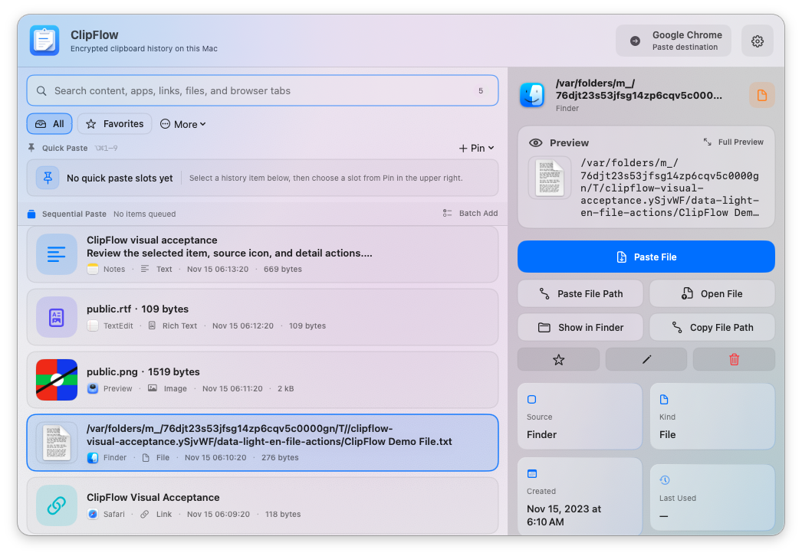
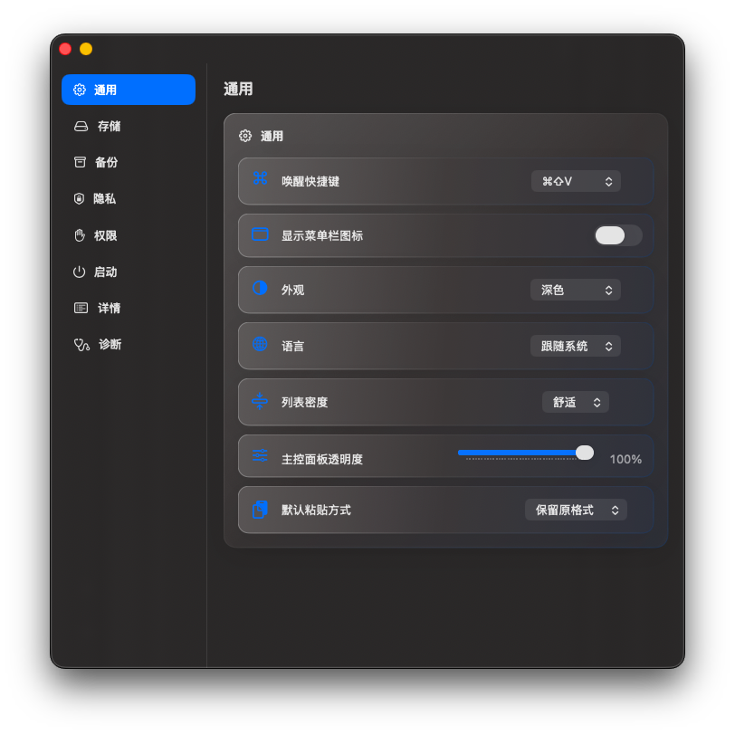
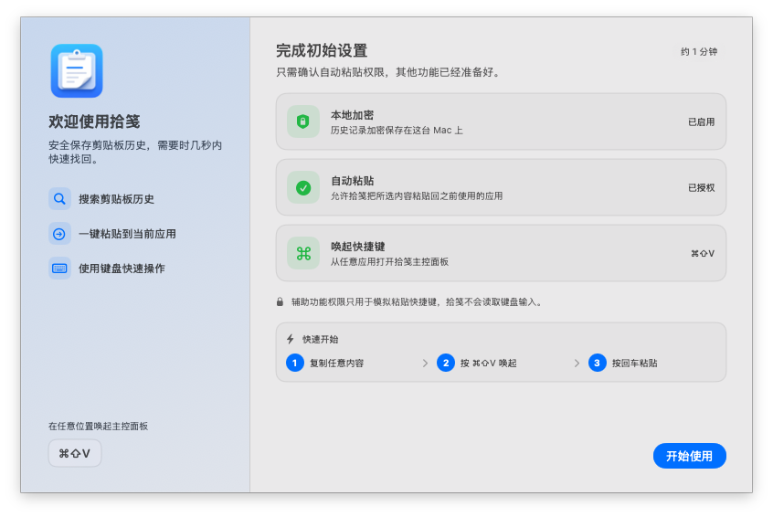
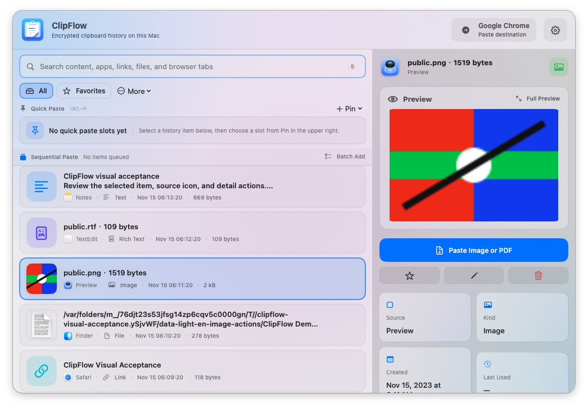
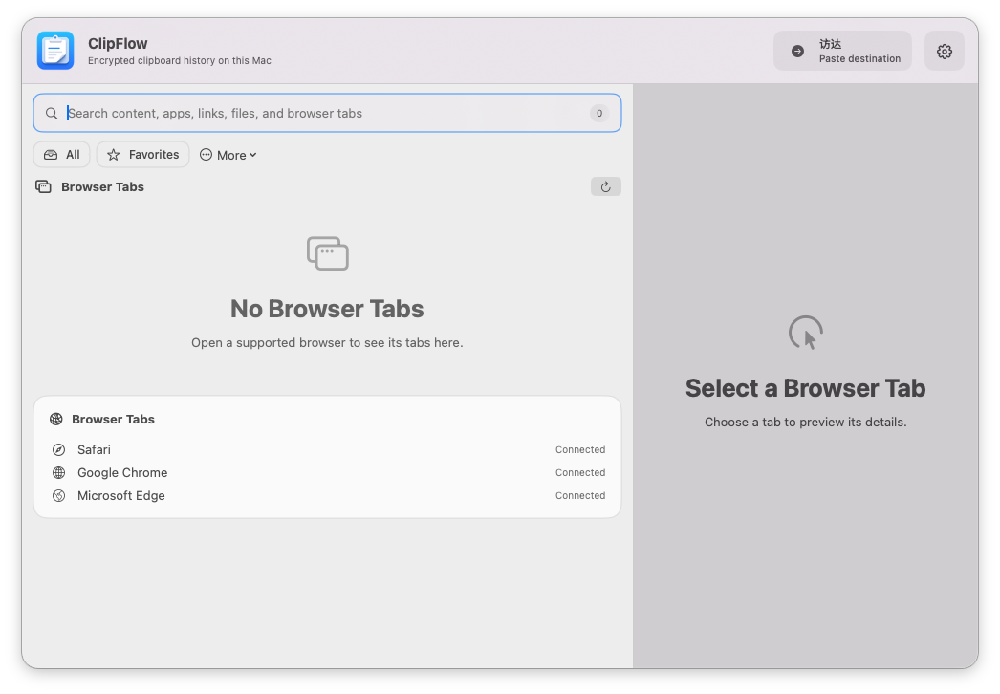

# 拾笺（ClipFlow）

[English](README.md) | 简体中文

拾笺（ClipFlow）是一款原生、注重隐私的 macOS 剪贴板管理器。它将剪贴板历史保存在本机，方便你快速检索过去复制过的内容，并为键盘优先的工作流而设计。

## 主要功能

- 捕获和还原文本、富文本、链接、文件、图片、PDF 及其他受支持的剪贴板表示形式。
- 搜索剪贴板历史，并按内容类型、收藏、链接、文件、图片、浏览器标签页与自定义分类浏览。
- 使用 `Command` + `Shift` + `V` 打开悬浮面板，粘贴、收藏、重命名、分类、预览或删除条目，键盘操作也保持顺手。
- 针对不同类型展示专属操作，例如粘贴文件、粘贴文件路径、在 Finder 中显示、打开链接、复制域名和完整预览。
- 支持保留原始格式或纯文本粘贴。
- 可将常用条目固定到 1 至 9 号槽位；即使拾笺面板关闭，也能用 `Option` + `Command` + `1` 至 `9` 全局粘贴对应内容，或加入连续粘贴队列按顺序逐条粘贴。
- 使用 macOS Vision 在本机识别新复制图片中的文字，并直接通过同一个搜索框检索。
- 可将敏感条目设为一次性或自动过期；成功粘贴或到期后会删除，且不会导出到备份。
- 可将文本条目保存为 `你好，{{name}}` 这类变量模板，填写变量后再粘贴渲染结果。
- 可选集成 Safari、Google Chrome 和 Microsoft Edge 的浏览器标签页浏览与激活功能。
- 使用 SQLCipher 加密剪贴板元数据，并单独加密较大的本地负载文件。
- 对重复复制做语义去重，并通过限制加载数量与静态时间标签降低历史列表滚动开销。
- 完全在你的 Mac 本机运行：没有账户、广告、分析、遥测或云端剪贴板处理。

## 界面预览

| 剪贴板历史 | 文件专属操作 |
| --- | --- |
|  |  |

| 设置 | 首次引导 |
| --- | --- |
|  |  |

| 图片预览 | 浏览器标签页 |
| --- | --- |
|  |  |

## 隐私与权限

剪贴板数据仅存储在本机。ClipFlow 仅在相关功能启用时请求可选的 macOS 权限：

- **辅助功能**：允许 ClipFlow 自动粘贴到此前活跃的应用。未授权时，ClipFlow 会还原剪贴板，你可以手动粘贴。
- **自动化**：仅在启用浏览器标签页集成时需要；浏览器控制始终在本机执行。
- **登录时启动**：可选。

当前测试包采用 Ad-hoc 签名，尚未 notarize。发给朋友体验时，首次打开可能需要在 **系统设置 -> 隐私与安全性** 中选择 **仍要打开**。自动粘贴还需要在 **系统设置 -> 隐私与安全性 -> 辅助功能** 中启用拾笺。

## 环境要求

- macOS 14 Sonoma 或更高版本
- Swift 6.2 工具链
- Homebrew（仅在初始化本地 SQLCipher 开发库时需要）

## 下载测试包

在 GitHub Releases 中分发给朋友时，优先使用 DMG：

1. 下载 `ClipFlow-<version>-macos.dmg`。
2. 打开 DMG，将 `ClipFlow.app` 拖到 `Applications`。
3. 从“应用程序”中启动拾笺。
4. 如果 macOS 阻止打开，到 **系统设置 -> 隐私与安全性** 中选择 **仍要打开**。

更新时，请先完全退出拾笺，再替换“应用程序”中的旧版本并重新启动。全局快捷粘贴还需要在 **系统设置 -> 隐私与安全性 -> 辅助功能** 中启用拾笺。

## 从源码构建

```bash
git clone git@github.com:osbrain/ClipFlow.git
cd ClipFlow

./scripts/bootstrap-dev-deps.sh
swift build
swift run ClipFlowCoreTests
```

打包本地 ad-hoc 签名的应用：

```bash
./scripts/package-app.sh debug
open artifacts/ClipFlow.app
```

如需 Release 配置，请执行：

```bash
./scripts/package-app.sh release
./scripts/package-dmg.sh
```

打包产物会输出到 `artifacts/`。

## 贡献

欢迎提交 Issue 和 Pull Request。请保持改动聚焦；在适用时补充相关测试；未经过讨论，请勿加入网络服务、分析工具或远程剪贴板处理功能。

## 许可证

ClipFlow 使用 [PolyForm Noncommercial License 1.0.0](LICENSE)。该许可证允许个人及其他非商业用途下的使用、修改和分发，但**禁止任何商业用途**。

本项目为源码可用（source-available）项目，而非 OSI 定义的开源软件：OSI 开源许可证必须允许商业使用。完整条款请查看 [LICENSE](LICENSE)。
